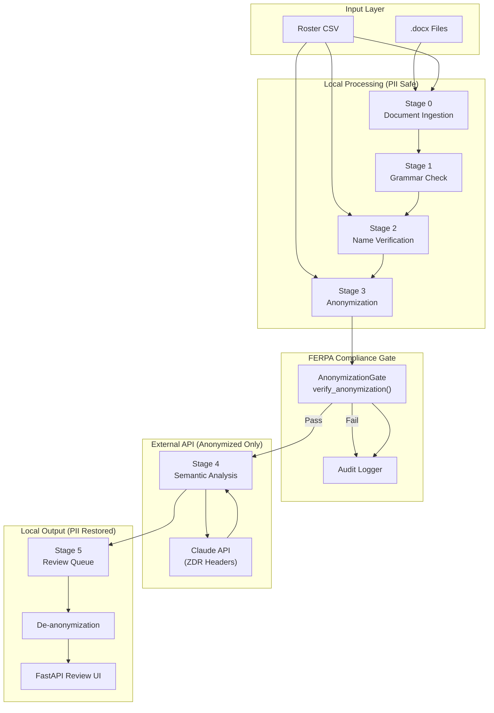
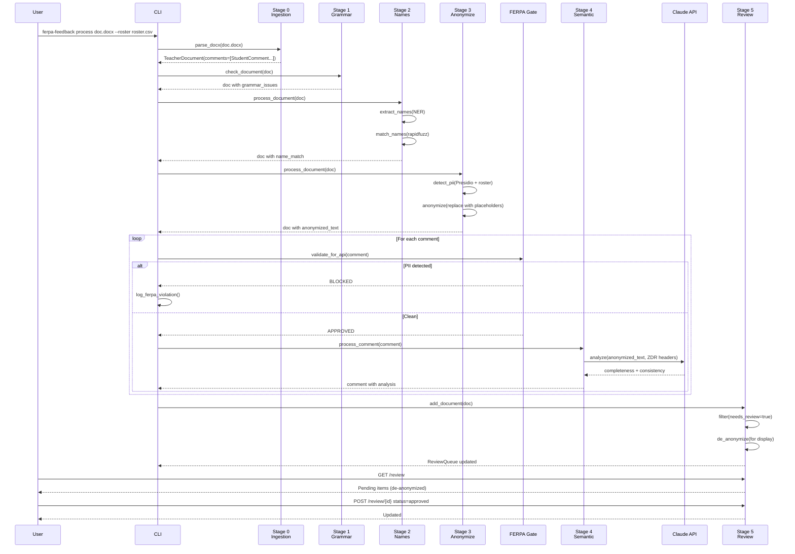

# Design: FERPA Pipeline Improvements

## Overview

This design addresses critical structural issues blocking the FERPA-compliant teacher comment feedback pipeline from running, implements the missing Stage 2 (Name Verification) and Stage 4 (Semantic Analysis) modules, and optimizes PII detection for 95% recall. The architecture follows the existing patterns of frozen Pydantic models, factory functions, and structlog logging while enforcing strict FERPA compliance through the anonymization gate.

## Architecture



## Project Structure Transformation

The core P0 fix requires restructuring the project to match `pyproject.toml` expectations.

### Current vs. Target Layout

| Current Location | Target Location | Action |
|-----------------|-----------------|--------|
| `models.py` | `src/ferpa_feedback/models.py` | Move |
| `pipeline.py` | `src/ferpa_feedback/pipeline.py` | Move |
| `stage_0_ingestion_improved.py` | `src/ferpa_feedback/stage_0_ingestion.py` | Move + Rename |
| `stage_1_grammar.py` | `src/ferpa_feedback/stage_1_grammar.py` | Move |
| *(missing)* | `src/ferpa_feedback/stage_2_names.py` | Create |
| `stage_3_anonymize.py` | `src/ferpa_feedback/stage_3_anonymize.py` | Move |
| *(missing)* | `src/ferpa_feedback/stage_4_semantic.py` | Create |
| *(missing)* | `src/ferpa_feedback/stage_5_review.py` | Create |
| *(missing)* | `src/ferpa_feedback/cli.py` | Create |
| *(missing)* | `src/ferpa_feedback/__init__.py` | Create |
| *(missing)* | `src/ferpa_feedback/recognizers/` | Create (dir) |

### Target Directory Structure

```
src/
  ferpa_feedback/
    __init__.py
    cli.py                    # Typer CLI entrypoint
    models.py                 # Unified Pydantic models
    pipeline.py               # Orchestrator
    stage_0_ingestion.py      # Document parsing
    stage_1_grammar.py        # LanguageTool integration
    stage_2_names.py          # Name verification (NEW)
    stage_3_anonymize.py      # PII anonymization
    stage_4_semantic.py       # Semantic analysis (NEW)
    stage_5_review.py         # Review queue (NEW)
    recognizers/
      __init__.py
      educational.py          # Custom Presidio recognizers
tests/
  __init__.py
  test_models.py
  test_stage_0.py
  test_stage_1.py
  test_stage_2.py
  test_stage_3.py
  test_stage_4.py
  test_stage_5.py
  conftest.py                 # Shared fixtures
  fixtures/
    sample_comments.json
    test_roster.csv
```

## Components

### Stage 0: Document Ingestion (Existing - Needs Model Unification)

**Purpose**: Parse .docx files into structured StudentComment records.

**Current Issue**: Defines its own `StudentComment` dataclass (lines 56-79 of `stage_0_ingestion_improved.py`) that conflicts with the Pydantic model in `models.py`.

**Resolution**: Remove the dataclass definition and use the unified Pydantic `StudentComment` from `models.py`. The Stage 0 output must include all required fields that downstream stages expect.

**Interface** (after unification):
```python
from ferpa_feedback.models import StudentComment, TeacherDocument

class DocumentParser:
    """Parses .docx files into TeacherDocument with StudentComment list."""

    def parse_docx(self, file_path: Path, document_id: str | None = None) -> TeacherDocument:
        """
        Parse document and return TeacherDocument with comments.

        All comments use the unified StudentComment model from models.py.
        """
        ...
```

### Stage 2: Name Verification (NEW)

**Purpose**: Detect when a comment mentions a different student than the one it is assigned to, preventing comments from being sent to the wrong student.

**Responsibilities**:
- Extract names from comment text using NER (GLiNER primary, spaCy fallback)
- Match extracted names against expected student using fuzzy matching (rapidfuzz)
- Flag mismatches with confidence scores (HIGH/MEDIUM/LOW)
- Handle edge cases: nicknames, hyphenated names, apostrophes, middle names

**Interfaces**:

```python
from typing import Protocol, Optional
from ferpa_feedback.models import (
    ClassRoster,
    ConfidenceLevel,
    NameMatch,
    StudentComment,
    TeacherDocument,
)

class NameExtractor(Protocol):
    """Protocol for name extraction backends."""

    def extract_names(self, text: str) -> list[tuple[str, float]]:
        """
        Extract names from text with confidence scores.

        Returns:
            List of (name, confidence) tuples.
        """
        ...

    def set_roster(self, roster: ClassRoster) -> None:
        """Update roster for context-aware extraction."""
        ...


class GLiNERExtractor:
    """Name extraction using GLiNER model."""

    def __init__(
        self,
        model_name: str = "urchade/gliner_base",
        threshold: float = 0.5,
        roster: Optional[ClassRoster] = None,
    ):
        ...

    def extract_names(self, text: str) -> list[tuple[str, float]]:
        """Extract PERSON entities from text."""
        ...


class SpaCyExtractor:
    """Name extraction using spaCy NER."""

    def __init__(
        self,
        model_name: str = "en_core_web_trf",
        roster: Optional[ClassRoster] = None,
    ):
        ...

    def extract_names(self, text: str) -> list[tuple[str, float]]:
        """Extract PERSON entities from text."""
        ...


class NameMatcher:
    """Fuzzy matching of extracted names to roster."""

    def __init__(
        self,
        threshold: int = 85,
        algorithm: str = "token_sort_ratio",
    ):
        """
        Args:
            threshold: Minimum similarity score (0-100) for a match.
            algorithm: rapidfuzz algorithm (token_sort_ratio, partial_ratio, etc.)
        """
        ...

    def match(
        self,
        extracted_name: str,
        expected_name: str,
        all_variants: list[str],
    ) -> NameMatch:
        """
        Match an extracted name against expected student.

        Args:
            extracted_name: Name found in comment text.
            expected_name: Expected student name from header.
            all_variants: All name variants for the expected student.

        Returns:
            NameMatch with similarity score and confidence level.
        """
        ...

    def _classify_confidence(self, score: float) -> ConfidenceLevel:
        """Map similarity score to confidence level."""
        ...


class NameVerificationProcessor:
    """Main processor for Stage 2."""

    def __init__(
        self,
        extractor: NameExtractor,
        matcher: NameMatcher,
        roster: Optional[ClassRoster] = None,
    ):
        ...

    def process_comment(self, comment: StudentComment) -> StudentComment:
        """
        Verify name usage in a single comment.

        Returns new StudentComment with name_match populated.
        """
        ...

    def process_document(self, document: TeacherDocument) -> TeacherDocument:
        """Process all comments in document."""
        ...


def create_name_processor(
    roster: Optional[ClassRoster] = None,
    config: Optional[dict] = None,
) -> NameVerificationProcessor:
    """Factory function matching existing stage patterns."""
    ...
```

**Configuration** (from settings.yaml):
```yaml
name_detection:
  model: "gliner"  # or "spacy", "hybrid"
  gliner:
    model_name: "urchade/gliner_base"
    threshold: 0.5
  spacy:
    model_name: "en_core_web_trf"
  fuzzy_match:
    threshold: 85
    algorithm: "token_sort_ratio"
```

### Stage 3: Anonymization (Existing - Needs Enhancement)

**Purpose**: Replace PII with placeholders before any external API calls.

**Enhancements Required**:
1. Add custom Presidio recognizers for educational PII
2. Configure thresholds for 95% recall target
3. Implement double-verification (detect -> anonymize -> re-detect)

**New Recognizers** (`src/ferpa_feedback/recognizers/educational.py`):

```python
from presidio_analyzer import Pattern, PatternRecognizer

class StudentIDRecognizer(PatternRecognizer):
    """Recognizes school student ID patterns."""

    PATTERNS = [
        Pattern(
            name="student_id_prefix",
            regex=r"\b[Ss]tudent[\s_-]?[Ii][Dd][:\s]*(\d{6,9})\b",
            score=0.9,
        ),
        Pattern(
            name="student_id_bare",
            regex=r"\b[Ss]\d{7,9}\b",  # S followed by 7-9 digits
            score=0.7,
        ),
    ]

    def __init__(self):
        super().__init__(
            supported_entity="STUDENT_ID",
            patterns=self.PATTERNS,
            context=["student", "id", "number"],
        )


class GradeLevelRecognizer(PatternRecognizer):
    """Recognizes grade level mentions that may identify students."""

    PATTERNS = [
        Pattern(
            name="grade_level",
            regex=r"\b(1[0-2]|[1-9])(?:st|nd|rd|th)?\s*[Gg]rad(?:e|er)\b",
            score=0.6,
        ),
        Pattern(
            name="freshman_etc",
            regex=r"\b(?:freshman|sophomore|junior|senior)\b",
            score=0.5,
        ),
    ]

    def __init__(self):
        super().__init__(
            supported_entity="GRADE_LEVEL",
            patterns=self.PATTERNS,
        )


class SchoolNameRecognizer(PatternRecognizer):
    """Recognizes school-specific terms that may identify location."""

    def __init__(self, school_patterns: list[str]):
        patterns = [
            Pattern(name=f"school_{i}", regex=p, score=0.8)
            for i, p in enumerate(school_patterns)
        ]
        super().__init__(
            supported_entity="SCHOOL_NAME",
            patterns=patterns,
        )
```

**Enhanced PIIDetector Configuration**:

```python
def create_enhanced_analyzer(
    roster: Optional[ClassRoster] = None,
    school_patterns: Optional[list[str]] = None,
    score_threshold: float = 0.3,  # Low threshold for high recall
) -> AnalyzerEngine:
    """
    Create Presidio analyzer with educational recognizers.

    Args:
        roster: Class roster for name-aware detection.
        school_patterns: School-specific patterns to detect.
        score_threshold: Minimum score for detection (lower = higher recall).
    """
    from presidio_analyzer import AnalyzerEngine
    from presidio_analyzer.nlp_engine import NlpEngineProvider

    # Create NLP engine
    provider = NlpEngineProvider(nlp_configuration={
        "nlp_engine_name": "spacy",
        "models": [{"lang_code": "en", "model_name": "en_core_web_lg"}],
    })
    nlp_engine = provider.create_engine()

    # Create analyzer with custom recognizers
    analyzer = AnalyzerEngine(
        nlp_engine=nlp_engine,
        supported_languages=["en"],
    )

    # Add educational recognizers
    analyzer.registry.add_recognizer(StudentIDRecognizer())
    analyzer.registry.add_recognizer(GradeLevelRecognizer())

    if school_patterns:
        analyzer.registry.add_recognizer(SchoolNameRecognizer(school_patterns))

    return analyzer
```

### Stage 4: Semantic Analysis (NEW)

**Purpose**: Analyze comment quality (completeness) and grade-comment consistency using Claude API with anonymized text only.

**Responsibilities**:
- Completeness analysis: specificity, actionability, evidence, length, tone
- Grade-comment consistency: sentiment alignment detection
- FERPA gate enforcement before all API calls
- ZDR header inclusion for zero data retention
- Retry logic for API rate limits

**Interfaces**:

```python
from typing import Optional
import anthropic
from ferpa_feedback.models import (
    CompletenessResult,
    ConfidenceLevel,
    ConsistencyResult,
    StudentComment,
    TeacherDocument,
)
from ferpa_feedback.stage_3_anonymize import AnonymizationGate

class FERPAEnforcedClient:
    """Anthropic client that enforces FERPA gate before all calls."""

    def __init__(
        self,
        api_key: Optional[str] = None,
        gate: AnonymizationGate = None,
        enable_zdr: bool = True,
    ):
        """
        Args:
            api_key: Anthropic API key (or from env ANTHROPIC_API_KEY).
            gate: FERPA anonymization gate (required).
            enable_zdr: Include zero data retention headers.
        """
        if gate is None:
            raise ValueError("FERPA gate is required for API client")
        self.gate = gate
        self.enable_zdr = enable_zdr
        self._client = anthropic.Anthropic(api_key=api_key)

    def analyze(
        self,
        comment: StudentComment,
        prompt: str,
        max_tokens: int = 1000,
    ) -> dict:
        """
        Send anonymized text to API with FERPA enforcement.

        Raises:
            FERPAViolationError: If comment fails FERPA gate.
        """
        safe_text = self.gate.get_safe_text(comment)
        if safe_text is None:
            raise FERPAViolationError(
                f"Comment {comment.id} blocked by FERPA gate"
            )

        headers = {}
        if self.enable_zdr:
            headers["anthropic-beta"] = "zero-data-retention-2024-08-01"

        # API call with retry logic
        ...


class CompletenessAnalyzer:
    """Analyzes comment completeness using rubric and LLM."""

    def __init__(
        self,
        client: FERPAEnforcedClient,
        rubric_path: Optional[Path] = None,
    ):
        """
        Args:
            client: FERPA-enforced API client.
            rubric_path: Path to completeness_rubric.yaml.
        """
        ...

    def analyze(self, comment: StudentComment) -> CompletenessResult:
        """
        Analyze completeness of a single comment.

        Uses combination of:
        1. Rule-based scoring (from rubric indicators)
        2. LLM analysis (for nuanced evaluation)
        """
        ...


class ConsistencyAnalyzer:
    """Analyzes grade-comment consistency."""

    def __init__(self, client: FERPAEnforcedClient):
        ...

    def analyze(
        self,
        comment: StudentComment,
        grade: str,
    ) -> ConsistencyResult:
        """
        Check if comment sentiment aligns with grade.

        Args:
            comment: The student comment.
            grade: The assigned grade (e.g., "A+", "C-", "72%").
        """
        ...


class SemanticAnalysisProcessor:
    """Main processor for Stage 4."""

    def __init__(
        self,
        completeness_analyzer: CompletenessAnalyzer,
        consistency_analyzer: ConsistencyAnalyzer,
        ferpa_gate: AnonymizationGate,
    ):
        ...

    def process_comment(self, comment: StudentComment) -> StudentComment:
        """
        Run semantic analysis on a single comment.

        CRITICAL: This method MUST verify FERPA gate before API calls.
        """
        # Double-check FERPA gate
        if not self.ferpa_gate.validate_for_api(comment):
            logger.error("ferpa_gate_blocked_stage4", comment_id=comment.id)
            return comment  # Return unmodified

        completeness = self.completeness_analyzer.analyze(comment)
        consistency = self.consistency_analyzer.analyze(comment, comment.grade)

        return StudentComment(
            **{
                **comment.model_dump(exclude={"completeness", "consistency"}),
                "completeness": completeness,
                "consistency": consistency,
            }
        )

    def process_document(self, document: TeacherDocument) -> TeacherDocument:
        """Process all comments in document."""
        ...


def create_semantic_processor(
    config: Optional[dict] = None,
    ferpa_gate: AnonymizationGate = None,
) -> SemanticAnalysisProcessor:
    """Factory function for Stage 4."""
    ...
```

**FERPA Gate Enforcement Pattern**:

```python
# Stage 4 MUST use this pattern for all API calls
class FERPAViolationError(Exception):
    """Raised when attempting to send PII to external API."""
    pass

def safe_api_call(gate: AnonymizationGate, comment: StudentComment, fn: Callable):
    """
    Wrapper ensuring FERPA compliance for any API call.

    Usage:
        result = safe_api_call(gate, comment, lambda text: client.analyze(text))
    """
    safe_text = gate.get_safe_text(comment)
    if safe_text is None:
        raise FERPAViolationError(f"FERPA gate blocked comment {comment.id}")

    # Log for audit
    logger.info(
        "api_call_authorized",
        comment_id=comment.id,
        text_hash=hashlib.sha256(safe_text.encode()).hexdigest()[:16],
    )

    return fn(safe_text)
```

### Stage 5: Review Queue (NEW)

**Purpose**: Enable human review of flagged comments with de-anonymized display.

**Responsibilities**:
- Queue management for flagged comments
- De-anonymization for human review display only
- Accept/reject/modify workflow
- Audit logging of review decisions
- Export of reviewed comments

**Interfaces**:

```python
from datetime import datetime
from typing import Optional
from pydantic import BaseModel
from ferpa_feedback.models import ReviewStatus, StudentComment, TeacherDocument

class ReviewItem(BaseModel):
    """A comment queued for review with de-anonymized display."""

    comment_id: str
    document_id: str
    student_name: str  # De-anonymized for reviewer
    grade: str

    # Display versions
    original_text: str      # Original with PII (for authorized reviewer only)
    anonymized_text: str    # For reference

    # Analysis results
    grammar_issues_count: int
    name_match_issues: list[str]
    completeness_score: Optional[float]
    consistency_issues: list[str]

    # Review workflow
    review_reasons: list[str]
    status: ReviewStatus
    reviewer_id: Optional[str]
    reviewed_at: Optional[datetime]
    reviewer_notes: str


class ReviewQueue:
    """Manages the review queue."""

    def __init__(self, storage_path: Optional[Path] = None):
        """
        Args:
            storage_path: Path to persist queue state.
        """
        ...

    def add_document(self, document: TeacherDocument) -> int:
        """
        Add flagged comments from document to queue.

        Returns number of items added.
        """
        ...

    def get_pending(self, limit: int = 50) -> list[ReviewItem]:
        """Get pending review items."""
        ...

    def update_status(
        self,
        comment_id: str,
        status: ReviewStatus,
        reviewer_id: str,
        notes: str = "",
    ) -> None:
        """Update review status with audit logging."""
        ...

    def export_approved(self, format: str = "json") -> str:
        """Export approved comments."""
        ...


class DeAnonymizer:
    """Restores original PII for human review."""

    def __init__(self, anonymizer: Anonymizer):
        """
        Args:
            anonymizer: The Anonymizer instance with mappings.
        """
        self.anonymizer = anonymizer

    def restore(self, comment: StudentComment) -> str:
        """
        Restore original text from anonymized version.

        CRITICAL: Only use for authorized human review.
        """
        if not comment.anonymized_text:
            return comment.comment_text

        return self.anonymizer.deanonymize(comment.anonymized_text)


def create_review_processor(
    storage_path: Optional[Path] = None,
) -> ReviewQueue:
    """Factory function for Stage 5."""
    ...
```

**FastAPI Review UI** (optional dependency):

```python
# src/ferpa_feedback/stage_5_review.py (continued)

def create_review_app(queue: ReviewQueue) -> "FastAPI":
    """
    Create FastAPI app for review UI.

    Requires: pip install ferpa-feedback[review-ui]
    """
    try:
        from fastapi import FastAPI, HTTPException, Request
        from fastapi.responses import HTMLResponse
        from fastapi.templating import Jinja2Templates
    except ImportError:
        raise ImportError(
            "Review UI requires FastAPI. Install with: "
            "pip install ferpa-feedback[review-ui]"
        )

    app = FastAPI(title="FERPA Comment Review")

    @app.get("/", response_class=HTMLResponse)
    async def review_list(request: Request):
        """Display pending review items."""
        items = queue.get_pending()
        ...

    @app.post("/review/{comment_id}")
    async def submit_review(
        comment_id: str,
        status: ReviewStatus,
        reviewer_id: str,
        notes: str = "",
    ):
        """Submit review decision."""
        queue.update_status(comment_id, status, reviewer_id, notes)
        ...

    @app.get("/export")
    async def export_approved(format: str = "json"):
        """Export approved comments."""
        return queue.export_approved(format)

    return app
```

### CLI Module (NEW)

**Purpose**: Provide command-line interface matching pyproject.toml entrypoint.

```python
# src/ferpa_feedback/cli.py
import typer
from pathlib import Path
from typing import Optional

app = typer.Typer(
    name="ferpa-feedback",
    help="FERPA-compliant teacher comment feedback system",
)

@app.command()
def process(
    input_path: Path = typer.Argument(..., help="Path to .docx file or directory"),
    roster: Optional[Path] = typer.Option(None, "--roster", "-r", help="Roster CSV"),
    config: Optional[Path] = typer.Option(None, "--config", "-c", help="Config YAML"),
    output: Optional[Path] = typer.Option(None, "--output", "-o", help="Output path"),
    stages: str = typer.Option("0,1,2,3", "--stages", "-s", help="Stages to run"),
):
    """Process teacher comment documents."""
    ...

@app.command()
def warmup():
    """Pre-load LanguageTool server to reduce cold start latency."""
    from ferpa_feedback.stage_1_grammar import GrammarChecker

    typer.echo("Warming up LanguageTool...")
    checker = GrammarChecker()
    _ = checker.tool  # Force lazy load
    typer.echo("LanguageTool ready.")

@app.command()
def review(
    port: int = typer.Option(8000, "--port", "-p"),
):
    """Start the review UI server."""
    try:
        import uvicorn
        from ferpa_feedback.stage_5_review import create_review_app, ReviewQueue

        queue = ReviewQueue()
        app = create_review_app(queue)
        uvicorn.run(app, host="0.0.0.0", port=port)
    except ImportError:
        typer.echo("Review UI requires: pip install ferpa-feedback[review-ui]")
        raise typer.Exit(1)

if __name__ == "__main__":
    app()
```

## Data Flow



## Technical Decisions

| Decision | Options Considered | Choice | Rationale |
|----------|-------------------|--------|-----------|
| NER Model for Stage 2 | GLiNER, spaCy, Stanza | GLiNER primary, spaCy fallback | GLiNER handles arbitrary entities without fine-tuning; spaCy provides reliable fallback. Both already listed in dependencies. |
| Fuzzy Matching Algorithm | Levenshtein, Jaro-Winkler, token_sort_ratio | token_sort_ratio (rapidfuzz) | Handles name order variations ("John Smith" vs "Smith, John") better than character-based algorithms. |
| StudentComment Unification | Keep both, adapter pattern, single model | Single Pydantic model | Eliminates type confusion, enables mypy strict mode, follows existing frozen model pattern. |
| Presidio Configuration | Default, custom recognizers, external NER | Custom recognizers + low threshold | Educational PII patterns (student IDs, grade levels) need custom detection. Low threshold (0.3) maximizes recall. |
| Stage 4 API Client | Direct anthropic calls, wrapped client | FERPAEnforcedClient wrapper | Guarantees FERPA gate check before every API call. Single enforcement point. |
| Review UI Framework | Flask, FastAPI, Streamlit | FastAPI (optional) | Already in optional deps, async support, OpenAPI docs, easy Jinja2 templates. |
| Project Structure | Flat, src layout, namespace packages | src layout | Matches existing pyproject.toml, prevents import shadowing, Python packaging best practice. |

## Error Handling

| Error Scenario | Handling Strategy | User Impact |
|----------------|-------------------|-------------|
| GLiNER model load failure | Fall back to spaCy NER | Warning logged, processing continues with fallback |
| Presidio detection failure | Log error, mark comment for review | Comment flagged, no PII missed |
| FERPA gate blocks comment | Skip Stage 4 for that comment, log violation | Comment marked needs_review, audit trail created |
| Claude API rate limit | Exponential backoff (3 retries, 1s/2s/4s) | Processing slows, completes eventually |
| Claude API timeout | Retry once, then skip semantic analysis | Comment lacks completeness/consistency scores |
| Invalid document format | Return empty TeacherDocument with warning | User notified, no crash |
| Name not found in roster | Use Presidio NER detection only | Name still anonymized via NER fallback |
| De-anonymization mapping missing | Return anonymized text with warning | Reviewer sees placeholders instead of names |

## Edge Cases

### Name Edge Cases (FR-16)

| Case | Example | Handling |
|------|---------|----------|
| Apostrophe | O'Brien, O'Connor | Regex pattern includes apostrophe in word boundary |
| Hyphenated | Smith-Jones, Mary-Kate | Hyphen allowed in name patterns |
| Prefix capitalization | McDonald, MacArthur | Case-insensitive matching with original case preserved |
| Middle names | Mary Jane Smith | fuzzy match considers all tokens |
| Jr/Sr suffix | John Smith Jr. | Strip suffixes before matching |
| Single name | Madonna, Prince | Match against first_name OR last_name |
| Nicknames | Bill/William, Bob/Robert | Roster `preferred_name` field + nickname expansion table |

### PII Edge Cases

| Case | Handling |
|------|----------|
| Name appears in different context | "Jackson pollock painting" - roster matching requires word boundary |
| Partial email | "contact@..." - regex still detects partial patterns |
| Date vs student ID | "12/15/2024" vs "S12152024" - different recognizers with context |
| Teacher name in comment | Roster only contains students; teacher names pass through (acceptable) |

## Test Strategy

### Unit Tests

**Stage 2 (`tests/test_stage_2.py`)**:
```python
class TestNameExtraction:
    def test_gliner_extracts_single_name(self): ...
    def test_gliner_extracts_multiple_names(self): ...
    def test_spacy_fallback_on_gliner_failure(self): ...
    def test_handles_apostrophe_names(self): ...  # O'Brien
    def test_handles_hyphenated_names(self): ...  # Smith-Jones
    def test_handles_mc_mac_prefixes(self): ...   # McDonald

class TestNameMatching:
    def test_exact_match_high_confidence(self): ...
    def test_nickname_match_medium_confidence(self): ...
    def test_wrong_name_low_confidence(self): ...
    def test_configurable_threshold(self): ...
```

**Stage 3 (`tests/test_stage_3.py`)**:
```python
class TestCustomRecognizers:
    def test_student_id_recognition(self): ...
    def test_grade_level_recognition(self): ...

class TestPIIRecall:
    """Ensure 95% recall target on test corpus."""
    @pytest.fixture
    def pii_test_corpus(self):
        """Load test corpus with known PII."""
        ...

    def test_recall_above_95_percent(self, pii_test_corpus): ...
```

**Stage 4 (`tests/test_stage_4.py`)**:
```python
class TestFERPAGateEnforcement:
    def test_blocks_unanonymized_comment(self): ...
    def test_blocks_comment_with_remaining_pii(self): ...
    def test_allows_clean_anonymized_comment(self): ...
    def test_raises_ferpa_violation_error(self): ...

class TestSemanticAnalysis:
    @pytest.fixture
    def mock_anthropic_client(self): ...

    def test_completeness_scoring(self, mock_anthropic_client): ...
    def test_consistency_detection(self, mock_anthropic_client): ...
```

### Integration Tests

```python
class TestPipelineIntegration:
    def test_full_pipeline_with_sample_document(self): ...
    def test_pipeline_with_roster(self): ...
    def test_ferpa_gate_integration(self): ...
    def test_no_pii_reaches_api(self): ...  # Critical compliance test
```

### E2E Tests (Review UI)

```python
@pytest.mark.skipif(not HAS_FASTAPI, reason="review-ui not installed")
class TestReviewUI:
    def test_review_list_loads(self, test_client): ...
    def test_submit_approval(self, test_client): ...
    def test_export_approved(self, test_client): ...
```

## Performance Considerations

| Component | Consideration | Mitigation |
|-----------|---------------|------------|
| GLiNER model loading | ~2-5s cold start | Lazy loading, optional warmup command |
| LanguageTool Java server | ~10-30s cold start | Already lazy-loaded, add warmup CLI command |
| Presidio with large roster | Pattern compilation overhead | Pre-compile on roster load, cache patterns |
| Claude API latency | ~1-3s per request | Batch comments where possible, async processing |
| Memory for large documents | Multiple copies during processing | Stream processing, limit concurrent comments |

## Security Considerations

| Requirement | Implementation |
|-------------|----------------|
| No PII to external API | FERPA gate with double-verification before every API call |
| ZDR headers | Enable by default in FERPAEnforcedClient |
| Audit logging | All API calls logged with comment_id and text_hash (not raw text) |
| Review access control | FastAPI middleware for authentication (implementation TBD) |
| Temporary file cleanup | delete_temp_files config option (default: true) |
| Credential handling | API keys from environment variables, not config files |

## Existing Patterns to Follow

Based on codebase analysis:

1. **Frozen Pydantic Models**: All data models use `model_config = ConfigDict(frozen=True)` for immutability
2. **Factory Functions**: Each stage has a `create_*` factory function accepting config dict
3. **structlog Logging**: All modules use `logger = structlog.get_logger()` with structured fields
4. **Lazy Loading**: Heavy resources (LanguageTool, Presidio) use lazy initialization via properties
5. **Document Processing Pattern**: `process_comment()` returns new instance, `process_document()` iterates and aggregates
6. **Config from YAML**: `settings.yaml` structure with nested stage configurations
7. **Type Annotations**: Full type hints for mypy strict compatibility

## Migration Path

### Phase 1: Structure Fix (P0)
1. Create `src/ferpa_feedback/` directory
2. Move and rename existing files
3. Create `__init__.py` files
4. Update imports to use package paths
5. Remove duplicate `StudentComment` from stage_0

### Phase 2: Stage 2 Implementation (P0)
1. Create `stage_2_names.py` with stubs
2. Implement `NameExtractor` with GLiNER
3. Implement `NameMatcher` with rapidfuzz
4. Wire into pipeline

### Phase 3: Presidio Enhancement (P1)
1. Create `recognizers/educational.py`
2. Update `PIIDetector` to use custom recognizers
3. Add recall tests with target threshold

### Phase 4: Stage 4 Implementation (P1)
1. Create `stage_4_semantic.py`
2. Implement `FERPAEnforcedClient`
3. Implement analyzers
4. Wire into pipeline

### Phase 5: Stage 5 Implementation (P2)
1. Create `stage_5_review.py`
2. Implement queue logic
3. Add FastAPI UI (optional)

### Phase 6: CLI and Polish (P2-P3)
1. Create `cli.py` with typer
2. Add warmup command
3. Dependency audit
