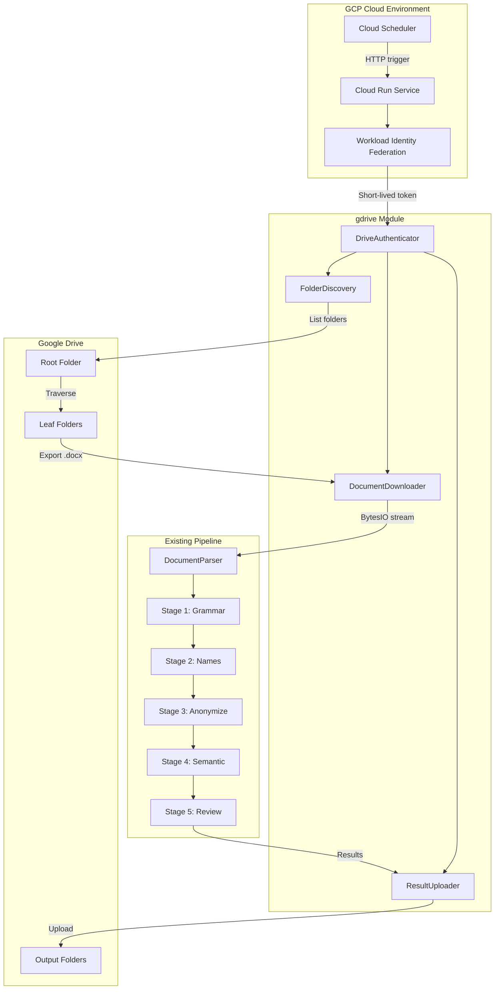
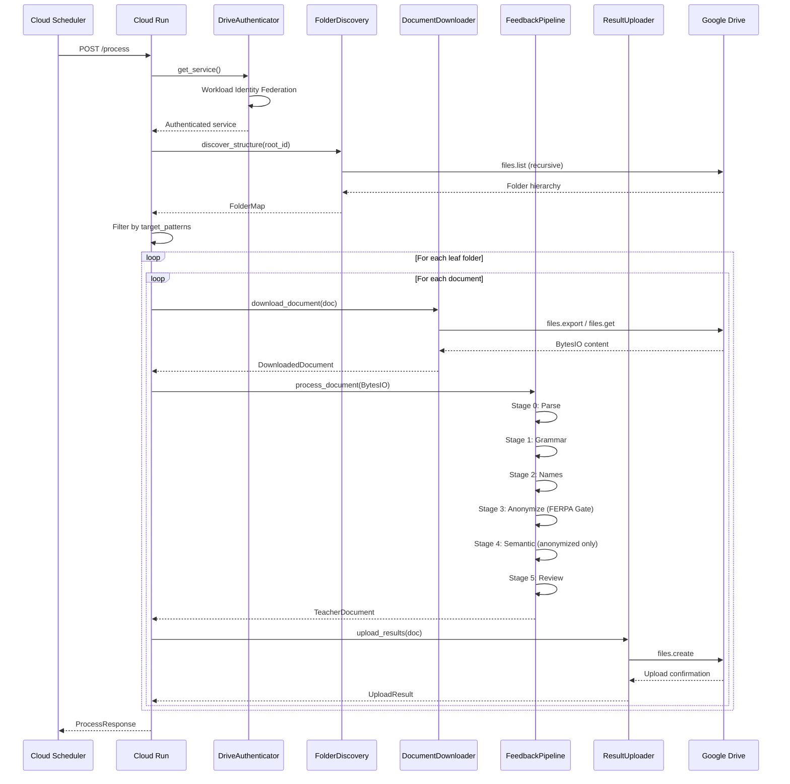

# Design: Google Drive Integration

## Overview

This design extends the FERPA-compliant feedback pipeline to ingest documents from Google Drive, process them through all 6 pipeline stages (0-5), and upload results back to Drive. The architecture introduces a new `gdrive` module that handles authentication (via Workload Identity Federation), folder discovery, document streaming, and result uploads, while integrating seamlessly with the existing `FeedbackPipeline` orchestrator.

## Architecture



## Component Details

### Component 1: DriveAuthenticator

**Purpose**: Manage Google Drive API authentication using Workload Identity Federation (production) or OAuth2 (development).

**Responsibilities**:
- Detect execution environment (Cloud Run vs local)
- Obtain credentials via Workload Identity Federation in GCP
- Fall back to OAuth2 for local development
- Provide authenticated Drive API service instance
- Refresh tokens before expiration

**File**: `src/ferpa_feedback/gdrive/auth.py`

**Interface**:
```python
from typing import Protocol
from googleapiclient.discovery import Resource

class DriveAuthenticator(Protocol):
    """Protocol for Drive authentication strategies."""

    def get_service(self) -> Resource:
        """Return authenticated Drive API service."""
        ...

    @property
    def service_account_email(self) -> str:
        """Return the service account email for sharing instructions."""
        ...


class WorkloadIdentityAuthenticator:
    """Production authenticator using Workload Identity Federation."""

    def __init__(
        self,
        project_id: str,
        pool_id: str,
        provider_id: str,
        service_account_email: str,
    ) -> None:
        """
        Initialize with Workload Identity Federation configuration.

        Args:
            project_id: GCP project ID
            pool_id: Workload Identity Pool ID
            provider_id: Workload Identity Provider ID
            service_account_email: Target service account email
        """
        ...


class OAuth2Authenticator:
    """Development authenticator using OAuth2 flow."""

    def __init__(
        self,
        client_secrets_path: Path,
        token_path: Path | None = None,
    ) -> None:
        """
        Initialize OAuth2 authenticator.

        Args:
            client_secrets_path: Path to OAuth2 client secrets JSON
            token_path: Path to store/load refresh token
        """
        ...


def create_authenticator(
    config: DriveConfig | None = None,
) -> DriveAuthenticator:
    """
    Factory function to create appropriate authenticator.

    Detects environment and returns:
    - WorkloadIdentityAuthenticator in Cloud Run
    - OAuth2Authenticator for local development
    """
    ...
```

---

### Component 2: FolderDiscovery

**Purpose**: Dynamically discover and map folder structure at the start of each processing run.

**Responsibilities**:
- Crawl folder hierarchy starting from root folder ID
- Build `FolderMap` data structure with IDs, names, depths, parent relationships
- Identify "leaf folders" (folders containing documents but no subfolders)
- Support pattern matching for `--target-folder` filtering
- Extract metadata (house, teacher, period) from folder names
- Log/export folder map as JSON for debugging

**File**: `src/ferpa_feedback/gdrive/discovery.py`

**Interface**:
```python
from dataclasses import dataclass, field
from typing import Iterator
import fnmatch
import re


@dataclass
class FolderNode:
    """Represents a single folder in the Drive hierarchy."""

    id: str
    name: str
    parent_id: str | None
    depth: int
    children: list["FolderNode"] = field(default_factory=list)
    documents: list["DriveDocument"] = field(default_factory=list)

    @property
    def is_leaf(self) -> bool:
        """True if folder contains documents but no subfolders."""
        return len(self.children) == 0 and len(self.documents) > 0

    @property
    def path(self) -> str:
        """Full path from root (for display)."""
        ...


@dataclass
class DriveDocument:
    """Represents a document discovered in Drive."""

    id: str
    name: str
    mime_type: str
    parent_folder_id: str
    modified_time: str
    size_bytes: int | None = None


@dataclass
class FolderMetadata:
    """Metadata extracted from folder path/names."""

    house: str | None = None
    teacher: str | None = None
    period: str | None = None
    raw_path: str = ""


@dataclass
class FolderMap:
    """Complete folder structure discovered from root."""

    root: FolderNode
    discovered_at: datetime
    total_folders: int
    total_documents: int
    leaf_folders: list[FolderNode] = field(default_factory=list)

    def get_leaf_folders(self) -> list[FolderNode]:
        """Return all leaf folders (processing targets)."""
        ...

    def filter_by_pattern(self, pattern: str) -> list[FolderNode]:
        """
        Filter leaf folders by name pattern.

        Supports glob patterns: "September*", "Interim*", etc.
        Matches against full path, not just folder name.
        """
        ...

    def filter_by_patterns(self, patterns: list[str]) -> list[FolderNode]:
        """Filter by multiple patterns (OR logic)."""
        ...

    def to_json(self) -> str:
        """Export map as JSON for debugging/auditing."""
        ...

    def print_tree(self, console: Console) -> None:
        """Print folder tree using rich console."""
        ...


class FolderDiscovery:
    """Discovers and maps Google Drive folder structure."""

    def __init__(
        self,
        service: Resource,
        rate_limiter: RateLimiter | None = None,
    ) -> None:
        """
        Initialize folder discovery.

        Args:
            service: Authenticated Drive API service
            rate_limiter: Optional rate limiter for API calls
        """
        ...

    def discover_structure(
        self,
        root_folder_id: str,
        max_depth: int = 10,
    ) -> FolderMap:
        """
        Discover complete folder structure from root.

        IMPORTANT: This runs fresh at every invocation.
        No caching between runs - structure may have changed.

        Args:
            root_folder_id: Google Drive folder ID to start from
            max_depth: Maximum folder depth to traverse (safety limit)

        Returns:
            FolderMap containing complete structure

        Raises:
            DriveAccessError: If root folder is not accessible
            DiscoveryTimeoutError: If discovery exceeds 30 seconds
        """
        ...

    def extract_metadata(
        self,
        folder: FolderNode,
        folder_map: FolderMap,
    ) -> FolderMetadata:
        """
        Extract house/teacher/period from folder path.

        Uses position in hierarchy:
        - Depth 1: House name
        - Depth 2: Teacher name
        - Depth 3: Period/Sprint name

        Args:
            folder: Target folder node
            folder_map: Complete folder map for path traversal

        Returns:
            Extracted metadata
        """
        ...


def match_folder_pattern(folder_path: str, pattern: str) -> bool:
    """
    Check if folder path matches pattern.

    Supports:
    - Glob patterns: "September*", "*Interim*"
    - Exact match: "Interim 1 Comments"
    - Case-insensitive matching

    Args:
        folder_path: Full path like "House1/TeacherA/September Comments"
        pattern: Pattern to match

    Returns:
        True if pattern matches any component of path
    """
    ...
```

---

### Component 3: DocumentDownloader

**Purpose**: Download and export documents from Google Drive as in-memory BytesIO streams.

**Responsibilities**:
- Export native Google Docs to .docx format via Drive API
- Download already-.docx files directly
- Stream content to BytesIO (no disk writes)
- Handle large files (>10MB warning)
- Support parallel downloads (configurable concurrency)
- Respect Google Drive API rate limits

**File**: `src/ferpa_feedback/gdrive/downloader.py`

**Interface**:
```python
from io import BytesIO
from dataclasses import dataclass
from typing import Iterator
import asyncio


@dataclass
class DownloadedDocument:
    """A document downloaded from Drive."""

    drive_document: DriveDocument
    content: BytesIO
    export_mime_type: str
    download_time_seconds: float

    @property
    def folder_metadata(self) -> FolderMetadata:
        """Metadata extracted from parent folder path."""
        ...


class DocumentDownloader:
    """Downloads documents from Google Drive."""

    # MIME type for Google Docs
    GOOGLE_DOCS_MIME = "application/vnd.google-apps.document"
    # Export format for Google Docs
    DOCX_MIME = "application/vnd.openxmlformats-officedocument.wordprocessingml.document"
    # Size warning threshold
    SIZE_WARNING_BYTES = 10 * 1024 * 1024  # 10MB

    def __init__(
        self,
        service: Resource,
        rate_limiter: RateLimiter | None = None,
        max_concurrent: int = 5,
    ) -> None:
        """
        Initialize downloader.

        Args:
            service: Authenticated Drive API service
            rate_limiter: Optional rate limiter
            max_concurrent: Maximum parallel downloads
        """
        ...

    def download_document(
        self,
        doc: DriveDocument,
    ) -> DownloadedDocument:
        """
        Download a single document to BytesIO.

        Args:
            doc: Document metadata from discovery

        Returns:
            Downloaded document with content stream

        Raises:
            DriveExportError: If export/download fails
            FileTooLargeError: If file exceeds limits
        """
        ...

    def download_batch(
        self,
        documents: list[DriveDocument],
        progress_callback: Callable[[int, int], None] | None = None,
    ) -> Iterator[DownloadedDocument | DownloadError]:
        """
        Download multiple documents with parallel execution.

        Args:
            documents: List of documents to download
            progress_callback: Called with (completed, total) counts

        Yields:
            DownloadedDocument on success, DownloadError on failure
        """
        ...

    async def download_batch_async(
        self,
        documents: list[DriveDocument],
    ) -> list[DownloadedDocument | DownloadError]:
        """Async batch download for Cloud Run optimization."""
        ...
```

---

### Component 4: DocumentParser Extension

**Purpose**: Extend existing DocumentParser to accept BytesIO streams in addition to file paths.

**Responsibilities**:
- Accept both Path and BytesIO as input
- Maintain backward compatibility with existing code
- Pass document metadata to TeacherDocument

**File**: `src/ferpa_feedback/stage_0_ingestion.py` (MODIFY existing)

**Interface Changes**:
```python
from io import BytesIO
from typing import Union

class DocumentParser:
    """Updated to support BytesIO input."""

    def parse_docx(
        self,
        source: Union[Path, BytesIO],
        document_id: str | None = None,
        metadata: dict[str, str] | None = None,
    ) -> TeacherDocument:
        """
        Parse a Word document into a TeacherDocument.

        Args:
            source: Path to .docx file OR BytesIO stream
            document_id: Optional ID (generated if not provided)
            metadata: Optional metadata (teacher_name, class_name, term)

        Returns:
            TeacherDocument with extracted comments
        """
        ...
```

---

### Component 5: ResultUploader

**Purpose**: Upload processing results back to Google Drive.

**Responsibilities**:
- Upload grammar reports to source folders
- Upload anonymized outputs to designated subfolders
- Handle file naming conventions
- Support overwrite vs versioning modes
- Retry failed uploads with exponential backoff

**File**: `src/ferpa_feedback/gdrive/uploader.py`

**Interface**:
```python
from dataclasses import dataclass
from enum import Enum


class UploadMode(Enum):
    """How to handle existing files."""
    OVERWRITE = "overwrite"
    VERSION = "version"  # Append timestamp to filename
    SKIP = "skip"


@dataclass
class UploadResult:
    """Result of an upload operation."""

    file_id: str
    file_name: str
    parent_folder_id: str
    success: bool
    error: str | None = None
    upload_time_seconds: float = 0.0


class ResultUploader:
    """Uploads processing results to Google Drive."""

    def __init__(
        self,
        service: Resource,
        rate_limiter: RateLimiter | None = None,
        upload_mode: UploadMode = UploadMode.OVERWRITE,
        max_retries: int = 3,
    ) -> None:
        """
        Initialize uploader.

        Args:
            service: Authenticated Drive API service
            rate_limiter: Optional rate limiter
            upload_mode: How to handle existing files
            max_retries: Retry count for failed uploads
        """
        ...

    def upload_grammar_report(
        self,
        report_content: str,
        original_doc: DriveDocument,
        folder_id: str,
    ) -> UploadResult:
        """
        Upload grammar report to source folder.

        Args:
            report_content: Grammar report text
            original_doc: Source document metadata
            folder_id: Target folder ID

        Returns:
            Upload result with file ID
        """
        ...

    def upload_anonymized_output(
        self,
        content: str,
        original_doc: DriveDocument,
        output_folder_id: str,
    ) -> UploadResult:
        """
        Upload anonymized document output.

        Args:
            content: Anonymized output text
            original_doc: Source document metadata
            output_folder_id: Target output folder ID

        Returns:
            Upload result with file ID
        """
        ...

    def ensure_output_folder(
        self,
        parent_folder_id: str,
        folder_name: str = "pipeline_outputs",
    ) -> str:
        """
        Create output folder if it doesn't exist.

        Args:
            parent_folder_id: Parent folder ID
            folder_name: Name for output folder

        Returns:
            Output folder ID
        """
        ...
```

---

### Component 6: DriveProcessor

**Purpose**: Orchestrate the complete Google Drive processing workflow.

**Responsibilities**:
- Coordinate discovery, download, pipeline, and upload
- Apply folder filtering (`--target-folder`)
- Track processing progress
- Generate processing summary
- Handle errors gracefully (continue on individual failures)

**File**: `src/ferpa_feedback/gdrive/processor.py`

**Interface**:
```python
from dataclasses import dataclass


@dataclass
class ProcessingProgress:
    """Progress tracking for batch processing."""

    total_documents: int
    processed_documents: int
    successful_documents: int
    failed_documents: int
    current_document: str | None = None
    current_stage: str | None = None


@dataclass
class ProcessingSummary:
    """Summary of a processing run."""

    started_at: datetime
    completed_at: datetime
    folder_map: FolderMap
    target_folders: list[FolderNode]
    total_documents: int
    successful: int
    failed: int
    grammar_issues_found: int
    pii_instances_replaced: int
    uploads_completed: int
    errors: list[dict[str, Any]]


class DriveProcessor:
    """Orchestrates Google Drive document processing."""

    def __init__(
        self,
        authenticator: DriveAuthenticator,
        pipeline: FeedbackPipeline,
        config: DriveConfig | None = None,
    ) -> None:
        """
        Initialize processor.

        Args:
            authenticator: Drive authentication provider
            pipeline: Configured FeedbackPipeline
            config: Optional Drive-specific configuration
        """
        ...

    def process(
        self,
        root_folder_id: str,
        target_patterns: list[str] | None = None,
        dry_run: bool = False,
        output_local: Path | None = None,
        progress_callback: Callable[[ProcessingProgress], None] | None = None,
    ) -> ProcessingSummary:
        """
        Execute full processing workflow.

        Steps:
        1. Discover folder structure (fresh each run)
        2. Filter to target folders (if patterns provided)
        3. Download documents as BytesIO
        4. Process through pipeline stages 0-5
        5. Upload results to Drive (unless output_local specified)

        Args:
            root_folder_id: Root folder to process
            target_patterns: Optional folder name patterns to filter
            dry_run: If True, list files without processing
            output_local: If set, write results locally instead of Drive
            progress_callback: Progress update callback

        Returns:
            Processing summary with statistics
        """
        ...

    def list_folders(
        self,
        root_folder_id: str,
    ) -> FolderMap:
        """
        Discover and return folder structure without processing.

        Used by --list-folders CLI option.
        """
        ...
```

---

### Component 7: CLI Extension

**Purpose**: Add `gdrive-process` command to existing CLI.

**File**: `src/ferpa_feedback/cli.py` (MODIFY existing)

**Interface**:
```python
@app.command()
def gdrive_process(
    root_folder: str = typer.Argument(
        ...,
        help="Google Drive folder ID to process",
    ),
    target_folder: Optional[List[str]] = typer.Option(
        None,
        "--target-folder", "-t",
        help="Filter to folders matching pattern (glob supported, repeatable)",
    ),
    list_folders: bool = typer.Option(
        False,
        "--list-folders", "-l",
        help="List discovered folders and exit without processing",
    ),
    dry_run: bool = typer.Option(
        False,
        "--dry-run",
        help="Show files that would be processed without processing",
    ),
    output_local: Optional[Path] = typer.Option(
        None,
        "--output-local", "-o",
        help="Write results to local path instead of Drive",
    ),
    roster: Optional[Path] = typer.Option(
        None,
        "--roster", "-r",
        help="Path to roster CSV for name matching",
    ),
    config: Optional[Path] = typer.Option(
        None,
        "--config", "-c",
        help="Path to settings.yaml",
    ),
    parallel: int = typer.Option(
        5,
        "--parallel", "-p",
        help="Number of parallel downloads",
    ),
    interactive: bool = typer.Option(
        False,
        "--interactive", "-i",
        help="Interactively select folders to process",
    ),
) -> None:
    """
    Process documents from Google Drive through the FERPA pipeline.

    Examples:
        # Process all documents in a folder
        ferpa-feedback gdrive-process 1abc123xyz

        # Process only September comments
        ferpa-feedback gdrive-process 1abc123xyz --target-folder "September*"

        # List folder structure
        ferpa-feedback gdrive-process 1abc123xyz --list-folders

        # Dry run
        ferpa-feedback gdrive-process 1abc123xyz --dry-run
    """
    ...
```

---

### Component 8: Cloud Deployment

**Purpose**: Deploy the processor as a Cloud Run service triggered by Cloud Scheduler.

**Files**:
- `Dockerfile`
- `cloudbuild.yaml`
- `terraform/main.tf` (or deployment scripts)

**Interface** (HTTP endpoint):
```python
# src/ferpa_feedback/gdrive/cloud_handler.py

from fastapi import FastAPI, HTTPException, Depends
from pydantic import BaseModel


class ProcessRequest(BaseModel):
    """Request body for processing trigger."""

    root_folder_id: str
    target_patterns: list[str] | None = None
    dry_run: bool = False


class ProcessResponse(BaseModel):
    """Response from processing run."""

    status: str  # "success", "partial", "failed"
    documents_processed: int
    documents_failed: int
    duration_seconds: float
    errors: list[str]


app = FastAPI()


@app.post("/process", response_model=ProcessResponse)
async def process_documents(
    request: ProcessRequest,
) -> ProcessResponse:
    """
    HTTP endpoint for Cloud Scheduler triggering.

    Uses Workload Identity Federation for authentication.
    Idempotency enforced via request deduplication.
    """
    ...


@app.get("/health")
async def health_check() -> dict:
    """Health check for Cloud Run."""
    return {"status": "healthy"}
```

---

## Data Flow



### Processing Flow Detail

1. **Authentication**: Cloud Run obtains short-lived token via Workload Identity Federation
2. **Discovery**: `discover_structure()` crawls from root folder, building complete FolderMap
3. **Filtering**: If `--target-folder` provided, filter leaf folders by pattern
4. **Download**: For each document in target folders, export Google Docs to .docx BytesIO
5. **Pipeline**: Pass BytesIO to DocumentParser, flow through Stages 0-5
6. **FERPA Gate**: Stage 3 anonymizes PII before Stage 4 (external API)
7. **Upload**: Upload grammar reports and anonymized outputs back to Drive
8. **Summary**: Return processing statistics

---

## Technical Decisions

| Decision | Options Considered | Choice | Rationale |
|----------|-------------------|--------|-----------|
| Authentication method | JSON key file, Workload Identity | Workload Identity | No secrets to manage; recommended by GCP; FERPA-compliant |
| File streaming | Temp files, BytesIO | BytesIO | No disk writes; python-docx supports it; more secure |
| Folder discovery timing | Cache between runs, Fresh each run | Fresh each run | Structure may change; ensures accuracy; 30-second limit acceptable |
| Pattern matching | Regex, Glob, Fuzzy | Glob (fnmatch) | Familiar syntax; sufficient for folder names; case-insensitive |
| Parallel downloads | Sequential, Thread pool, Asyncio | Thread pool (5 default) | Balances speed vs rate limits; configurable |
| Metadata extraction | Hardcoded levels, Pattern matching | Position-based | Simple; matches documented folder structure; extensible |
| Error handling | Fail-fast, Continue-on-error | Continue-on-error | One bad document should not stop 240-document batch |
| Output location | Same folder, Subfolder | Subfolder ("pipeline_outputs") | Keeps source folders clean; clear separation |
| Deployment platform | Cloud Functions, Cloud Run | Cloud Run | Better for long-running jobs (60 min limit); container flexibility |
| Rate limiting | Token bucket, Fixed window | Fixed window | Matches Google's 1000/100sec quota; simpler |

---

## File Structure

| File | Action | Purpose |
|------|--------|---------|
| `src/ferpa_feedback/gdrive/__init__.py` | Create | Package exports |
| `src/ferpa_feedback/gdrive/auth.py` | Create | Authentication (WIF + OAuth2) |
| `src/ferpa_feedback/gdrive/discovery.py` | Create | Folder discovery and mapping |
| `src/ferpa_feedback/gdrive/downloader.py` | Create | Document download/export |
| `src/ferpa_feedback/gdrive/uploader.py` | Create | Result upload |
| `src/ferpa_feedback/gdrive/processor.py` | Create | Orchestration |
| `src/ferpa_feedback/gdrive/config.py` | Create | Drive-specific configuration |
| `src/ferpa_feedback/gdrive/errors.py` | Create | Custom exceptions |
| `src/ferpa_feedback/gdrive/rate_limiter.py` | Create | API rate limiting |
| `src/ferpa_feedback/gdrive/cloud_handler.py` | Create | FastAPI HTTP handler |
| `src/ferpa_feedback/stage_0_ingestion.py` | Modify | Add BytesIO support to DocumentParser |
| `src/ferpa_feedback/cli.py` | Modify | Add gdrive-process command |
| `settings.yaml` | Modify | Add gdrive configuration section |
| `pyproject.toml` | Modify | Add google-auth-httplib2, add cloud dependencies |
| `Dockerfile` | Create | Cloud Run container |
| `cloudbuild.yaml` | Create | Cloud Build deployment |
| `terraform/` | Create | Infrastructure as code (optional) |
| `tests/test_gdrive_discovery.py` | Create | Discovery unit tests |
| `tests/test_gdrive_downloader.py` | Create | Downloader unit tests |
| `tests/test_gdrive_integration.py` | Create | Integration tests |

---

## Configuration Extension

Add to `settings.yaml`:
```yaml
# Google Drive Integration
gdrive:
  # Authentication
  auth:
    # Method: "workload_identity" (production) or "oauth2" (development)
    method: "workload_identity"

    # Workload Identity Federation settings (production)
    workload_identity:
      project_id: "your-project-id"
      pool_id: "github-actions-pool"  # or your pool name
      provider_id: "github-provider"
      service_account_email: "ferpa-pipeline@your-project.iam.gserviceaccount.com"

    # OAuth2 settings (development)
    oauth2:
      client_secrets_path: "./secrets/client_secrets.json"
      token_path: "./.gdrive_token.json"

  # Processing
  processing:
    max_concurrent_downloads: 5
    download_timeout_seconds: 120
    discovery_timeout_seconds: 30
    max_folder_depth: 10

  # Upload
  upload:
    mode: "overwrite"  # overwrite, version, skip
    output_folder_name: "pipeline_outputs"
    max_retries: 3
    retry_delay_seconds: 1

  # Rate limiting
  rate_limit:
    requests_per_100_seconds: 900  # Under Google's 1000 limit
```

---

## Error Handling

| Error Scenario | Handling Strategy | User Impact |
|----------------|-------------------|-------------|
| Root folder not accessible | Raise `DriveAccessError` with clear message | Process aborts, shows sharing instructions |
| Single document download fails | Log error, continue with other documents | Document skipped, noted in summary |
| Discovery timeout (>30s) | Raise `DiscoveryTimeoutError` | Process aborts, suggest reducing scope |
| Rate limit exceeded | Exponential backoff, auto-retry | Slight delay, process continues |
| Google Docs export fails | Log warning, skip document | Document skipped, noted in summary |
| File too large (>10MB) | Log warning, continue processing | Warning in logs, may timeout |
| Upload fails | Retry 3x with backoff, then log error | Result may not be uploaded |
| Anonymization verification fails | Log error, block document | Document blocked from Stage 4+ |
| No documents in target folders | Return empty summary | No processing, clear message |
| Pattern matches no folders | Return empty summary with pattern warning | No processing, shows discovered structure |

---

## Edge Cases

- **Empty folders**: Skipped during discovery (not leaf folders)
- **Nested empty folders**: Parent with only empty children is not a leaf
- **Mixed content folders**: Folder with both documents and subfolders processes the documents
- **Duplicate file names**: File IDs are unique; names don't matter for processing
- **Special characters in names**: Use Drive API's file ID, not name, for operations
- **Very deep hierarchies**: `max_depth=10` safety limit prevents infinite recursion
- **Circular folder references**: Impossible in Google Drive (DAG structure)
- **Files shared but folder not**: Access error caught per-file, documented
- **Google Sheets in folder**: Ignored (filter by MIME type)
- **Large folder (500+ items)**: Pagination handled; may approach 30-second limit
- **Concurrent runs**: Idempotency via request deduplication (future: distributed lock)
- **Partial OAuth2 credentials**: Clear error message with setup instructions

---

## Test Strategy

### Unit Tests

**discovery.py**:
- `test_discover_structure_simple_hierarchy` - 3-level tree
- `test_discover_structure_identifies_leaf_folders` - Correct leaf detection
- `test_filter_by_pattern_glob` - "September*" matches correctly
- `test_filter_by_pattern_multiple` - Multiple patterns (OR)
- `test_extract_metadata_from_path` - House/Teacher/Period extraction
- `test_folder_map_to_json` - Serialization roundtrip

**downloader.py**:
- `test_download_google_doc_exports_to_docx` - MIME type conversion
- `test_download_existing_docx` - Direct download
- `test_download_returns_bytesio` - No disk writes
- `test_download_handles_large_file_warning` - Size threshold

**uploader.py**:
- `test_upload_grammar_report` - Correct folder/naming
- `test_upload_overwrite_mode` - Replaces existing
- `test_upload_version_mode` - Appends timestamp
- `test_upload_retry_on_failure` - Exponential backoff

**Mocking**: Use `unittest.mock` to mock Google API responses

### Integration Tests

- `test_end_to_end_local_oauth` - Full flow with OAuth2 (requires manual setup)
- `test_discovery_with_real_folder` - Against test Drive folder
- `test_download_and_parse_real_doc` - Verify python-docx compatibility
- `test_upload_and_verify` - Upload then re-download to verify

**Test Fixtures**: Create shared test Drive folder with known structure

### E2E Tests (Cloud)

- `test_cloud_run_health_check` - Verify deployment
- `test_cloud_scheduler_trigger` - End-to-end scheduled run
- `test_workload_identity_auth` - WIF works in Cloud Run

**Environment**: Dedicated test GCP project with test Drive folder

---

## Performance Considerations

- **Discovery parallelization**: Use `files.list` with `q` parameter, not recursive calls
- **Batch downloads**: Concurrent downloads up to API limits (5 default)
- **Memory management**: Process documents one at a time; clear BytesIO after use
- **Rate limiting**: Stay under 900/100sec to avoid hitting 1000 limit
- **Cold start**: Pre-warm by importing heavy dependencies at module level
- **Cloud Run sizing**: 2GB RAM, 4 vCPU for 240-document batches

### Performance Targets

| Metric | Target | Rationale |
|--------|--------|-----------|
| Cold start | <30 seconds | AC-7.2; includes GCP auth |
| Discovery (500 folders) | <30 seconds | NFR-13 |
| Download (per document) | <5 seconds | 240 docs in 60 min = 15 sec/doc budget |
| Pipeline (per document) | <10 seconds | Existing performance baseline |
| Upload (per document) | <2 seconds | Simple text files |
| Full batch (240 docs) | <60 minutes | NFR-1 |

---

## Security Considerations

- **No JSON key files**: Workload Identity Federation only
- **Short-lived tokens**: Automatic rotation via WIF
- **FERPA gate enforced**: Stage 3 must pass before Stage 4
- **No PII in logs**: Use document IDs, not student names
- **TLS 1.2+**: Enforced by Google APIs
- **Audit logging**: All Drive operations logged with timestamps
- **Minimum permissions**: Service account has only Drive scope
- **OAuth2 dev mode**: Tokens stored locally, never committed

---

## Existing Patterns to Follow

Based on codebase analysis:

1. **Pydantic models**: Use `@dataclass` for internal data, Pydantic for API boundaries
2. **Structlog logging**: Use `structlog.get_logger()` with structured fields
3. **Factory functions**: `create_*()` pattern for configurable components
4. **Protocol typing**: Use `Protocol` for dependency injection interfaces
5. **Typer CLI**: Follow existing `@app.command()` pattern with rich console
6. **Configuration**: Extend `settings.yaml` with new section; use `PipelineConfig` pattern
7. **Error isolation**: In batch processing, catch per-document errors and continue
8. **Testing**: pytest fixtures in `conftest.py`, mock external services

---

## Dependencies to Add

Add to `pyproject.toml`:
```toml
dependencies = [
    # ... existing ...
    "google-auth>=2.20.0",
    "google-auth-httplib2>=0.2.0",
]

[project.optional-dependencies]
cloud = [
    "fastapi>=0.109.0",
    "uvicorn>=0.25.0",
    "gunicorn>=21.0.0",
]
```

---

## Implementation Phases

### Phase 1: Core Infrastructure (P0)
- `DriveAuthenticator` (OAuth2 only for initial dev)
- `FolderDiscovery` with `FolderMap`
- `DocumentDownloader` with BytesIO support
- `DocumentParser` BytesIO modification

### Phase 2: Integration (P0)
- `DriveProcessor` orchestration
- `ResultUploader`
- CLI `gdrive-process` command
- `--list-folders` and `--target-folder` support

### Phase 3: Cloud Deployment (P0)
- `Dockerfile` and `cloudbuild.yaml`
- Workload Identity Federation setup
- Cloud Run deployment
- Cloud Scheduler integration

### Phase 4: Robustness (P1)
- Rate limiting
- Progress checkpointing
- Parallel downloads
- Interactive folder selection
